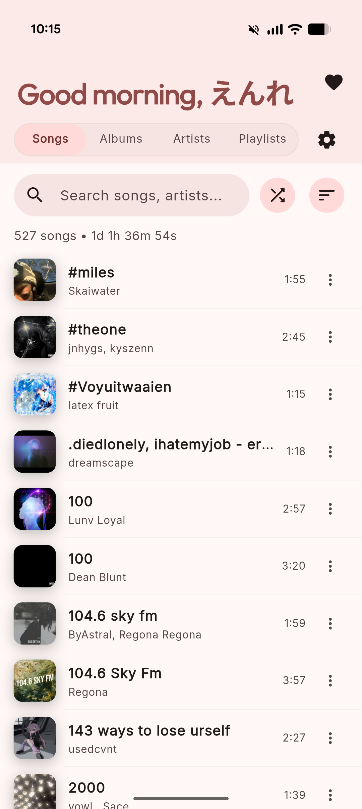
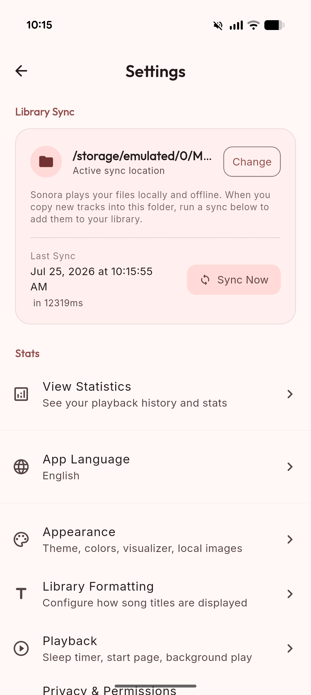

# Sonora

[](https://github.com/yurtemre7/sonora/actions/workflows/release.yml)

*🌐 他の言語で読む: [English](README.md)*

Sonora は Flutter で構築された、プライバシーを最優先にしたローカル音楽プレイヤーです。Material 3 Expressive デザインを採用し、アルバムアートおよび Material You（壁紙カラー）から動的にテーマカラーを生成します。ディレクトリベースのライブラリ同期、マルチバンドイコライザー & サウンドエフェクト（MFX）、複数曲の一括操作（マルチセレクト）、シームレスなバックグラウンド再生を実現しており、ファイルのコピーやアップロードは一切行いません。主な対象プラットフォームは Android で、Windows ビルドにも対応しています。

> [!NOTE]
> **AI に関する注記:** このプロジェクトは Google の Antigravity エージェント型コーディングフレームワークを使用し、AI の支援のもとで全面的に構築されています。すべてのコード・アーキテクチャ・機能は、AI と人間のペアプログラミングを通じて設計・実装・改善されました。

## スクリーンショット

<p align="center">
  
  &nbsp;&nbsp;&nbsp;&nbsp;
  
</p>

## 機能

### ライブラリ & 同期

- **ディレクトリベースの同期**: 任意のフォルダを指定して、ファイルをアプリストレージにコピーすることなく音楽を直接再生できます。
- **増分同期**: ファイルサイズと更新タイムスタンプを利用して変更のないファイルをスキップし、再スキャンを高速化します。すべてのスキャン処理はバックグラウンドアイソレートで実行されるため、UI の応答性が維持されます。
- **即時起動**: 起動時にキャッシュされたライブラリデータをミリ秒単位で読み込み、メタデータと再生時間をバックグラウンドで非同期更新します。
- **幅広いフォーマット対応**: `.mp3`、`.m4a`、`.mp4`、`.aac`、`.flac`、`.ogg`、`.opus`、`.wav`、`.wma`、`.amr`、`.3gp`、`.ts`、`.mkv`、`.mid`、`.midi` などに対応しています。
- **ID3 メタデータ & アートワーク**: タグはバックグラウンドアイソレートで解析され、アルバムアートはディスクにキャッシュされて高速に読み込まれます。
- **歌詞の検出**: サイドカー形式の `.lrc` および `.txt` 歌詞ファイルを同期時に自動検出します。
- **手動 & 自動の再同期**: ライブラリの任意のタブでプルリフレッシュ、設定画面の「今すぐ同期」ボタン、および月次リマインダーバナー（30日間スヌーズ可能）による再同期に対応しています。
- **同期詳細パネル**: ライブラリの合計サイズ、検出されたオーディオフォーマット、ユニークなダイナミックテーマ数、歌詞同期済み曲数を表示します。
- **オンボーディング**: ようこそ画面・同期の説明・権限設定・フォルダ選択の4ステップで構成される初回起動フローを備えています。

### ライブラリブラウジング & 一括操作

- **4つのタブ**: 曲・アルバム（グリッド表示）・アーティスト・プレイリストの各タブを、折りたたみ可能なアプリバーの下に配置しています。
- **マルチセレクト一括操作**: 任意の曲を長押しして複数選択モードに入り、プレイリストへの一括追加、次に再生、キュー追加、お気に入りトグル、システム共有シートからの共有が可能です。
- **検索**: タブごとのリアルタイムフィルタリングと高速な部分一致検索に対応しています。
- **並べ替えオプション**: タイトル・アーティスト・再生時間・追加日・トラック数など、タブごとに独自の並べ替え順と昇降順トグルを設定できます。設定はアプリ再起動後も保持されます。
- **アルバム & アーティスト詳細画面**: ぼかしアートワーク背景・全曲再生/シャッフル再生アクション・ヒーロートランジション・アーティストアルバムカルーセルを備えています。
- **プレイリスト管理**: ドラッグで並べ替え、再生/シャッフル、スワイプで削除、M3U プレイリストのエクスポート/インポート、確認付き削除に対応しています。
- **クイックシャッフル**: 任意のタブヘッダーや詳細画面から1タップでシャッフル再生できます。
- **お気に入り**: 曲タイル、一括操作、再生中画面のアニメーション付きハートボタンからトグル操作できる組み込みのお気に入りプレイリストを搭載しています。
- **曲コンテキストメニュー & 詳細情報**: 次に再生、キューに追加、プレイリストに追加、フォルダを開く、メタデータ（ビットレート、サンプルレート、フォーマット、パス、サイズ）の確認が可能です。
- **再生中トラックのハイライト**: 現在再生中の曲がライブラリ一覧内で視覚的に強調表示されます。

### 再生 & オーディオエンジン

- **フルトランスポートコントロール**: 再生/一時停止・次/前の曲・経過時間と残り時間付きのシークバー・シャッフル・リピート（オフ → 全曲 → 1曲）を搭載しています。
- **キュー管理**: 再生中画面の「次に再生」タブで、ドラッグによる並べ替え・スワイプで削除・タップでジャンプが可能です。
- **イコライザー & MFX**: Lo-Fi、Warmth、Bass Boost などのプリセットや、カスタマイズ可能なマルチバンドグラフィックイコライザー、ピッチ・再生速度のリアルタイム調整に対応しています。
- **スリープタイマー**: プリセットまたはカスタム時間から選択。通知アクション（+1分延長/終了）、「現在の曲が終わるまで再生」モード、曲末尾でのスムーズな音量フェードアウトに対応しています。
- **オーディオフォーカス制御**: イヤホン切断時の一時停止、ダッキング設定、再接続時の自動再開に対応しています。
- **関連トラック**: 再生中画面の「関連」タブに「このアルバムの他の曲」と「このアーティストの他の曲」を表示します。
- **閉じても再生を続ける**: アプリを閉じた後もバックグラウンド再生を継続するオプション設定です。

### 再生中 & UI

- **Material 3 Expressive デザイン**: Outfit・Inter フォント、円形コントロール、ぼかし背景アートワーク、カスタムスタイルのスライダーを採用しています。
- **グローバルミニプレイヤー**: ライブ進行バー付きの常時表示ボトムバーです。タップで展開、上下スワイプで開閉、左右スワイプでトラックをスキップできます。
- **再生中シート**: ぼかしアートワーク背景・トランスポートコントロール・タブコンテンツ（歌詞 / 次に再生 / 関連）を備えたフルスクリーンモーダルです。
- **複数のレイアウトスタイル**: モダン、レコード盤、ミニマリストから選択可能です。
- **統一されたテーマ & カラー設定**: 1タップで切り替え可能な SegmentedButton（システム・ライト・ダーク、Material You 壁紙カラー・アルバムアート動的テーマ・カスタムアクセントカラー）を搭載しています。
- **AMOLED ピュアブラック**: 有機ELディスプレイ向けの完全な黒背景モードです。
- **歌詞表示**: `.lrc` ファイルの自動スクロール・アクティブ行ハイライト・タップでシーク、`.txt` ファイルのスクロール表示に対応しています。
- **オーディオビジュアライザー**: 再生画面下部にアニメーション付きの波形バーをオプションで表示します。

### 統計

- **リスニングダッシュボード**: 設定からアクセス可能な5ページの統計画面です。
- **概要**: 総再生時間、完奏回数、再生したアルバム/アーティスト/プレイリスト数、最初に聴いた曲、最も聴いた曲、ユニーク曲数、最も音楽を聴いた曜日を表示します。
- **トップチャート**: 上位5曲、アルバム、アーティスト、プレイリストを表示し、タップで再生できます。
- **統計のリセット**: 確認プロンプト付きでリスニング履歴を消去できます。

### Android 統合 & ネイティブブリッジ

- **バックグラウンド再生**: フォアグラウンドサービスにより、通知ドロワーやロック画面でフルメディアコントロールを提供します。
- **ネイティブ Kotlin ブリッジ**: 外部依存を削減し、URL 起動、パッケージ情報取得、ファイル共有、ハードウェアアクセラレーションによる画像切り抜き/リサイズを直接 Kotlin で高速に処理します。
- **通知コントロール**: メディア操作やインタラクティブなスリープタイマー操作（+1分、終了）を通知シェードから直接実行できます。

---

## アーキテクチャ

Sonora は `go_router` を使用したクリーンで疎結合なコンポーネントで構成されています:

```
lib/
├── models/
│   ├── song.dart            - 曲のメタデータモデル
│   ├── playlist.dart        - プレイリストモデル
│   └── grouping.dart        - アルバム/アーティストのグルーピングヘルパー
├── providers/
│   ├── player_provider.dart  - 再生、キュー、ライブラリ、オーディオ効果、スリープタイマーの状態管理
│   ├── settings_provider.dart - アプリ設定と ThemeColorSource の状態管理
│   └── theme_provider.dart   - ThemeMode の設定管理
├── routing/
│   ├── app_router.dart      - GoRouter のルーティング設定
│   ├── app_routes.dart      - ルートパス定数
│   └── app_navigation.dart  - 型付きナビゲーションヘルパー
├── screens/
│   ├── home_screen.dart              - メインタブ画面（曲 / アルバム / アーティスト / プレイリスト）
│   ├── now_playing_screen.dart       - 再生中フルスクリーン画面（歌詞 / キュー / 関連）
│   ├── album_detail_screen.dart      - アルバム詳細画面
│   ├── artist_detail_screen.dart     - アーティスト詳細画面
│   ├── playlist_detail_screen.dart   - プレイリスト詳細画面（M3U 入出力対応）
│   ├── settings/                     - モジュール化された設定画面群
│   ├── stats_screen.dart             - 統計ダッシュボード
│   └── onboarding_screen.dart        - 初回起動フロー
├── services/
│   ├── audio_handler.dart            - AudioService バックグラウンドコントローラー
│   ├── music_scanner.dart            - ファイルシステムスキャンとライブラリキャッシュ
│   ├── lyrics_service.dart           - LRC/TXT 歌詞の読み込みと解析
│   ├── stats_service.dart            - 再生時間と再生回数のトラッキング
│   ├── permission_service.dart       - ストレージと通知の権限管理
│   ├── native_bridge.dart            - ネイティブ Android Kotlin ブリッジ
│   └── sleep_timer_notification_service.dart - スリープタイマー通知制御
├── theme/
│   └── app_theme.dart         - Material 3 テーマ設定とタイポグラフィ
├── utils/
│   ├── color_extractor.dart   - アルバムアートのカラー抽出
│   └── logger.dart            - ルートとデバッグのロギング
├── widgets/                   - 再利用可能な UI コンポーネント
├── app.dart                   - アプリのブートストラップとライフサイクル
└── main.dart                  - エントリーポイント
```

## 動作要件

- [FVM](https://fvm.app/) と Flutter **3.47.0**（`.fvmrc` で固定）
- Dart SDK **^3.13.0**
- Android SDK **24+**（コンパイル/ターゲット SDK 37）
- 接続済みの Android デバイスまたはエミュレーター

## はじめに

1. **リポジトリをクローンする:**

   ```bash
   git clone https://github.com/yurtemre7/sonora.git
   cd sonora
   ```

2. **固定された Flutter バージョンをインストールし、依存関係を取得する:**

   ```bash
   fvm install
   fvm flutter pub get
   ```

3. **静的解析を実行する:**

   ```bash
   fvm flutter analyze
   ```

4. **テストを実行する:**

   ```bash
   fvm flutter test
   ```

5. **接続済みのデバイスまたはエミュレーターで実行する:**

   ```bash
   fvm flutter run
   ```

6. **リリース APK をビルドする:**

   ```bash
   fvm flutter build apk --release
   ```

## リリース

`main` へのコミットメッセージにリリースプレフィックスが含まれている場合（例：`release: v1.19.1` または `chore(release): bump to version 1.19.1`）、GitHub Actions によって自動的にリリース APK がビルドされます。バージョン履歴の詳細は [CHANGELOG.md](CHANGELOG.md) を参照してください。

## ライセンス

このプロジェクトは MIT ライセンスのもとで公開されています — 詳細は [LICENSE](LICENSE) ファイルを参照してください。
